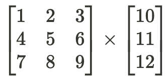

# Review:

#### Ceritakan apa itu OOP, object oriented programming
**Jawaban**

*OOP(Object Oriented Programming) adalah contoh pemrograman berisi data dan metode yang konsepnya didasarkan pada “objek” dengan tujuan untuk meningkatkan fleksibilitas dan perawatan program. OOP mengelompokkan data dan metodenya dalam satu lokasi membuat suatu program lebih mudah untuk dipahami*

**Nilai**

| | |
| --- | --- |
| Maksimum | 4 |
| Nilai | 2 |
| Review | Jawaban tepat, tapi kurang lengkap. Bagian OOP adalah encapsulation, inheritance, dan polymorphism tidak diterangkan.  |

#### Di java 8 ada dua komponen untuk implementasi abstraksi lebih baik, yaitu stream dan lambda. Ceritakan apa itu. Pada saat apakah kita membutuhkan stream atau lambda.

**Jawaban**

*Lambda adalah fungsi anonim atau tidak memiliki nama dan tidak terikat pada kelas apapun
 Stream adalah operasi sekuensial yang mendukung paralelisme pada itemnya dan memuat waktu eksekusi program lebih cepat cara klasik
 Lamda dan stream digunakan untuk mempersingkat fungsi yang memiliki operasi yang sama(paralel)*

**Nilai**

| | |
| --- | --- |
| Maksimum | 4 |
| Nilai | 1 |
| Review | Jawaban terlalu dangkal.| 

#### Apa perbedaan antara interface, abstract kelas.

**Jawaban**

*Interface*
 -	Hanya boleh memiliki satu metode abstrak(statis atau default) -- **Bisa lebih dari satu**
 -	Mendukung multiple-inheritance -- **Untuk menggantikan multi-inheritance**
 -	Hanya memiliki statis dan final variable --  **Kurang tepat**
 -	Tidak menyediakan implementasi kelas abstrak -- **??**
 -	Membernya secara default bersifat publik
 
 *Abstract kelas*
 -	Bisa memiliki metode abstrak dan non-abstark
 -	Tidak mendukung multiple-inheritance -- **Pernyataan ini kurang tepat**
 -	Dapat memiliki variabel final, non-final, statis, dan non-statis.
 -	Dapat menyediakan implementasi antarmuka. **??**
 -	Dapat memiliki member private, protected dll

**Nilai**

| | |
| --- | --- |
| Maksimum | 3 |
| Nilai | 1 |
| Review | Jawaban abstract terlalu dangkal. Jawaban untuk interface kurang tepat |

#### Apa itu functional interface, dibutuhkan pada saat apakah?

**Jawaban**

*Functional interface adalah suatu interface yang memiliki hanya satu metode abstrak tetapi bisa memiliki beberapa metode default dan mendeklarasikan satu metode kelas objek. Dibutuhkan saat suatu interface hanya menggunakan satu metode abstrak*

**Nilai**

| | |
| --- | --- |
| Maksimum | 3 |
| Nilai | 1.5 |
| Review | Jawaban tidak menjawab pertanyaan kedua, "saat dibutuhkan" |

#### Terangkan apa itu SOLID principle. Apakah berguna?

**Jawaban**

*SOLID principle adalah prinsip/pola desain yang merupakan kumpulan dari 5 prinsip desain, antara lain: Single Responsibility Principle, Open-Closed Principle, Liskov Substitution Principle, Interface Segregation Principle, and Dependency Inversion Principle, memubat isi program lebih mudah diakses dan dipahami,memantu menghindari code/script yang bertumpuk(busuk),  dan menjaga kualitas software yang baik.*

*Sangat berguna untuk pemeliharaan program*

**Nilai**

| | |
| --- | --- |
| Maksimum | 4 |
| Nilai | 3 |
| Review | Jawaban terlalu dangkal. |

#### Jika saya mempunyai integer : 1234567 , buat lah fungsi yang keluarannya 7654321 tanpa menggunakan library, atau string  prosesing.

**Nilai**

| | |
| --- | --- |
| Maksimum | 2 |
| Nilai | 0 |
| Review | Pembuatan public class salah. Jawaban logic salah. Integer 1234567, bukan array 1234567 |

#### Saya memiliki matrix sebagai berikut:

Buat matrix class yang mempunya behavior untuk perkalian matrix. Coba untuk menyelesaikan perkalian matrix diatas.

**Nilai**

| | |
| --- | --- |
| Maksimum | 3 |
| Nilai | 0 |
| Review | Pembuatan public class salah, dan jawaban atas kelas tidak tepat |

#### Apa itu unit testing. Bedakah dengan integration testing? Apa bedanya?

**Jawaban**

*Unit testing adalah pengujian modul secara terpisah atau individu untuk memastikan code berjalan dengan benar*
*Integration testing adalah pengujian beberapa modul yang berbeda untuk memastikan akan berfungsi dengan baik saat digabungkan*

**Nilai**

| | |
| --- | --- |
| Maksimum | 4 |
| Nilai | 4 |
| Review | Jawaban sudah tepat. |

#### Terangkan apa itu TDD.

**Jawaban**

*TDD(Test-Driven Development) adalah proses pengembangan software yang mencakup pengembangan test-first, artinya melakukan testing/pengujian terlebih dahulu sebelum melakukan implementasi. Langkah-langkahnyya dapat dilakukan sebagai berikut:*
1.	Memahami persyaratan untuk suatu fitur tertentu
2.	Memuat serangkaian tes untuk menguji fitur tersebut tanpa terlalu memperhatikan code(error)
3.	Mengemangkan fitur tersebut sampai berjalan dengan baik(tidak error)
4.	Memperaiki code agar lebih mudah dibaca dan dipelihara

**Nilai**

| | |
| --- | --- |
| Maksimum | 4 |
| Nilai | 1.5 |
| Review | Jawaban terlalu dangkal, dan tidak tepat. |
